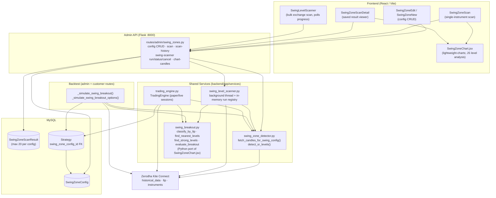
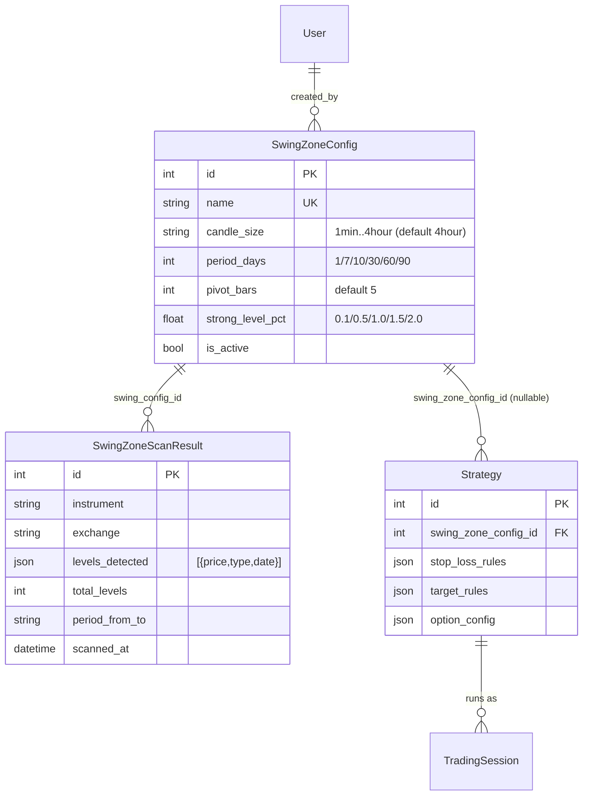
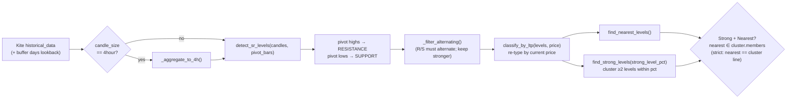
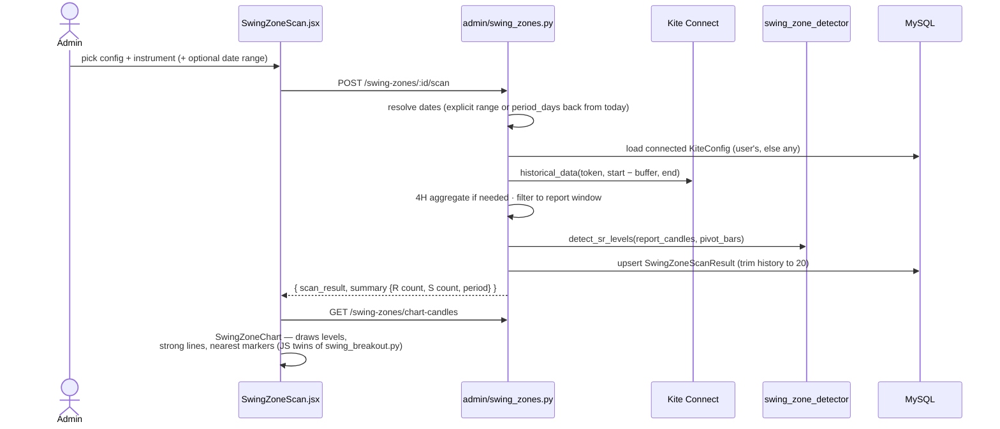
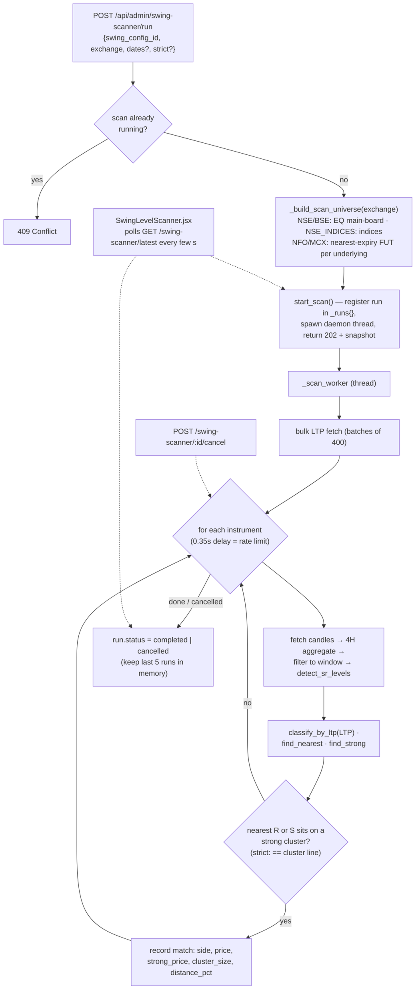
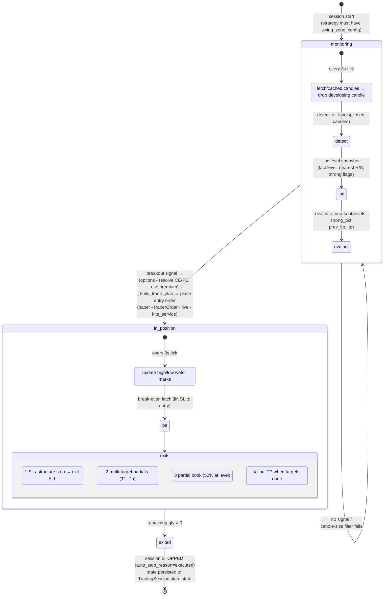
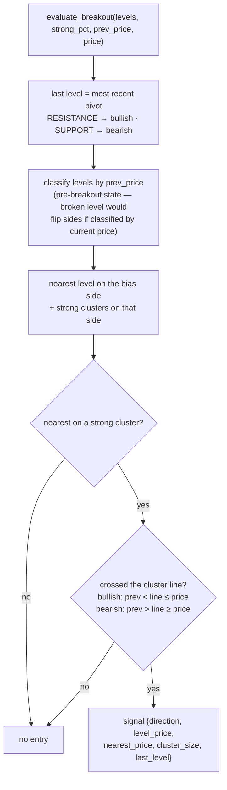
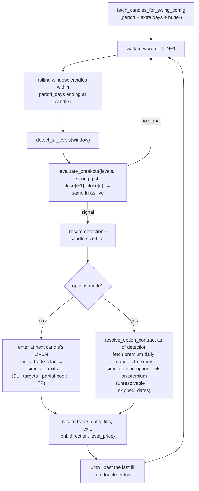

# Swing Level — Architecture & Flow

The **Swing Level** feature detects support/resistance (S&R) price levels from swing
pivots, identifies *strong* level clusters and the level *nearest* to price, and uses
the combined **"Strong + Nearest"** condition as the entry signal for breakout trading.
One shared rule set powers four surfaces: the admin chart, the bulk scanner, the
backtest simulator, and the live/paper trading engine — so what you see on the chart
is exactly what trades.

---

## 1. Core Concepts

| Concept | Definition | Where computed |
|---|---|---|
| **Swing level (pivot)** | A candle whose high is strictly greater than `pivot_bars` candles on each side → RESISTANCE; mirror for lows → SUPPORT | `swing_zone_detector.detect_sr_levels()` |
| **Alternating filter** | R and S levels must alternate chronologically; consecutive same-type levels keep the stronger one (higher R / lower S) | `swing_zone_detector._filter_alternating()` |
| **Classification by LTP** | A level's final type is decided by current price: above LTP → RESISTANCE, at/below → SUPPORT | `swing_breakout.classify_by_ltp()` |
| **Nearest levels** | Closest RESISTANCE above price and closest SUPPORT below price | `swing_breakout.find_nearest_levels()` |
| **Strong level (cluster)** | ≥ 2 same-type levels within `strong_level_pct`% of each other. Resistance cluster line = MAX price; support cluster line = MIN price | `swing_breakout.find_strong_levels()` |
| **Strong + Nearest** | The nearest level is a *member* of a strong cluster (or, in `strict` mode, *is* the cluster's line price). This is the tradeable setup | `swing_level_scanner._evaluate_instrument()` / `swing_breakout.evaluate_breakout()` |
| **Last-level bias** | The most recently formed level sets trade direction: RESISTANCE → bullish (buy), SUPPORT → bearish (sell) | `swing_breakout.find_last_level()` |
| **Breakout entry** | Price crosses through the strong cluster's line between the previous tick/candle and the current one, in the bias direction | `swing_breakout.evaluate_breakout()` |

---

## 2. Component Architecture

**Key design choice — single source of truth for the rule:**
[swing_breakout.py](backend/app/services/swing_breakout.py) is an explicit Python port
of the level-analysis helpers in
[SwingZoneChart.jsx](frontend/src/components/admin/SwingZoneChart.jsx). The scanner,
backtester, and live engine all import it, guaranteeing chart ↔ scan ↔ backtest ↔ live
parity.

---

## 3. Data Model

- `SwingZoneConfig` is the reusable detection recipe (admin-managed).
- `SwingZoneScanResult` stores per-instrument scan snapshots; history is capped at
  **20 rows per config** (oldest trimmed on insert).
- A `Strategy` links to one config via `swing_zone_config_id`
  (migration `c5d6e7f8a9b0_swing_level_strategies.py`); the engine and backtest refuse
  to run a strategy without it.
- Bulk-scanner runs are **not persisted** — they live in an in-memory registry
  (last 5 runs) inside `swing_level_scanner.py`.

---

## 4. Level-Detection Pipeline

Every surface runs the same pipeline over candles:

Candle fetching (`fetch_candles_for_swing_config`) adds an interval-specific
**buffer** before the report window so pivots near the window start have lookback
context, and clamps to Kite's per-interval max range:

| candle_size | Kite interval | buffer days | max fetch days |
|---|---|---|---|
| 1min | minute | 3 | 60 |
| 5min | 5minute | 5 | 100 |
| 15min | 15minute | 7 | 200 |
| 30min | 30minute | 10 | 200 |
| 1hour | 60minute | 15 | 400 |
| 4hour | 60minute → aggregated | 40 | 400 |

---

## 5. Flow 1 — Single-Instrument Scan (Admin)

`POST /api/admin/swing-zones/<config_id>/scan` — synchronous; result persisted and
rendered on `SwingZoneScan` → `SwingZoneChart`.

---

## 6. Flow 2 — Bulk Swing-Level Scanner (Background)

Scans **every instrument on an exchange** for the Strong + Nearest setup.
Asynchronous because Kite's historical API is rate-limited (~3 req/s), so a full
NSE scan takes minutes.

A match means: *this instrument's next obstacle in price is also a strong wall* —
the chart's merged **"Strong + Nearest"** line — i.e. a candidate for the breakout
strategy.

---

## 7. Flow 3 — Live / Paper Trading Engine

`TradingEngine` (one thread per active `TradingSession`) owns the full
**monitor → breakout entry → multi-target exit** lifecycle. It polls LTP every 3 s
(WebSocket ticker when available, REST fallback) and caches swing candles for 5 min.

The breakout decision itself (shared with backtest):

**Options mode:** if `strategy.option_config.enabled`, the breakout is detected on the
underlying, then the engine resolves the CE/PE contract (strike selection + expiry
policy), swaps its LTP subscription to the option, and builds the trade plan against
the **premium** — always a long position (BUY to enter, SELL to exit).

---

## 8. Flow 4 — Backtest Simulation

`POST /api/{admin|customer}/backtest/strategies/<id>/run` →
`_simulate_swing_breakout` (equity/futures) or `_simulate_swing_breakout_options`.

Because the simulator calls the same `detect_sr_levels` + `evaluate_breakout` pair as
the engine, backtest results are a faithful candle-granularity replay of live behavior
(live uses tick LTP instead of candle closes — the only intentional difference).

---

## 9. API Surface

All under the Admin app (`:8000`), `@admin_required`:

| Method & Path | Purpose |
|---|---|
| `GET/POST /api/admin/swing-zones` | List / create configs |
| `GET/PUT/DELETE /api/admin/swing-zones/<id>` | Read / update / delete a config |
| `POST /api/admin/swing-zones/<id>/scan` | Synchronous single-instrument scan (persists result) |
| `GET /api/admin/swing-zones/<id>/scan-history` | Last 20 scan results |
| `GET /api/admin/swing-zones/<id>/scan/<result_id>` | One saved result (+ `strong_level_pct` for chart) |
| `GET /api/admin/swing-zones/chart-candles` | OHLC for the chart (IST-shifted timestamps, 4H grouping) |
| `POST /api/admin/swing-scanner/run` | Start bulk background scan (202; 409 if one is running) |
| `GET /api/admin/swing-scanner/latest` / `/<run_id>` | Poll run progress + matches |
| `POST /api/admin/swing-scanner/<run_id>/cancel` | Request cancellation |

Frontend pages: [SwingZoneEdit.jsx](frontend/src/pages/admin/SwingZoneEdit.jsx) /
[SwingZoneNew.jsx](frontend/src/pages/admin/SwingZoneNew.jsx) (config CRUD),
[SwingZoneScan.jsx](frontend/src/pages/admin/SwingZoneScan.jsx) +
[SwingZoneScanDetail.jsx](frontend/src/pages/admin/SwingZoneScanDetail.jsx) (scan & chart),
[SwingLevelScanner.jsx](frontend/src/pages/admin/SwingLevelScanner.jsx) (bulk scanner with
progress bar, match table, strict toggle).

---

## 10. Cross-Cutting Concerns & Constraints

- **Rate limiting** — bulk scanner sleeps 0.35 s between historical calls (~3 req/s
  Kite limit) and bulk-fetches LTPs in batches of 400.
- **Closed candles only** — the live engine drops the developing candle before pivot
  detection, so signals never form on an unfinished bar.
- **Pre-breakout classification** — `evaluate_breakout` classifies levels by
  `prev_price`, not current price, because at the crossing tick the broken level would
  have already flipped from RESISTANCE to SUPPORT (or vice-versa).
- **Validation gates** — `strong_level_pct ∈ {0.1, 0.5, 1.0, 1.5, 2.0}`,
  date ranges clamped per interval, one bulk scan at a time, minimum
  `pivot_bars × 2 + 1` candles to detect anything.
- **Resilience** — engine state persists to `TradingSession.plan_state` on every
  meaningful change; active sessions are re-instantiated on Flask restart. Scanner
  runs, by contrast, are deliberately ephemeral (in-memory, last 5).
- **JS/Python duplication** — `SwingZoneChart.jsx` and `swing_breakout.py` implement
  the same math twice. Any change to clustering/nearest/classification logic **must be
  made in both** or the chart will disagree with the scanner/engine.
